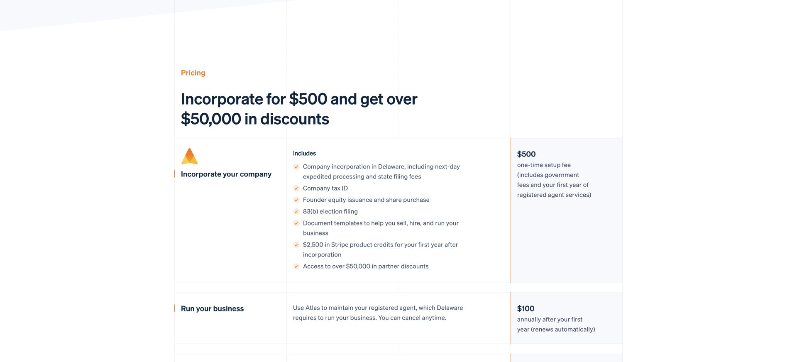

If I were starting a SaaS today, these are the services I'd look at first.

## Company, banking, and payments

If you want to operate through a US company, I'd consider **Stripe Atlas for company formation, Mercury for a business account, and Stripe for payments.**

You don't need to form a US company just to build a SaaS. If you already have a suitable company, bank account, and payment setup, there's no reason to start over.

[Stripe Atlas](https://stripe.com/atlas) helps you form a company in Delaware and apply for an EIN, the company's tax ID. The [signup guide](https://docs.stripe.com/atlas/signup) explains the paperwork.

Atlas charges a **one-time \$500 fee**, including state filing fees and the first year of registered agent service. The registered agent service costs **\$100 a year after that**. Ongoing company expenses, including tax filing, are separate.

*Stripe Atlas pricing page. Screenshot taken on October 10, 2026.*

For banking, I'd look at [Mercury](https://mercury.com/). It offers business accounts and money management tools, with banking services provided by partner banks. A separate business account makes income and expenses easier to track.

Atlas offers a [shortcut to the Mercury application](https://support.stripe.com/questions/sharing-your-company-information-with-atlas-partners?locale=en-GB). With your permission, it shares some company details so you don't have to enter them again. Opening the bank account and activating Stripe Payments still require separate reviews. Forming the company doesn't guarantee approval for either.

*Mercury's public website. Screenshot taken on October 9, 2026.*

For web payments, [Stripe Checkout](https://docs.stripe.com/payments/checkout) is where I'd start. It supports subscriptions and one-time payments. I'd get payment and access to the service working before spending time on a custom checkout page.

## Domain and hosting

[Cloudflare Registrar](https://developers.cloudflare.com/registrar/) would be my pick for the domain. It's handy to keep the domain, DNS, and hosting settings together.

Cloudflare [recommends Workers for new projects](https://developers.cloudflare.com/pages/). [Workers can serve static files](https://developers.cloudflare.com/workers/static-assets/) as well as run your API, so it can cover both the frontend and backend if your stack is compatible.

Check that your framework and dependencies work in the Workers runtime before choosing it. A backend that runs on a regular server may need changes to run there.

*Cloudflare Workers Static Assets documentation. Screenshot taken on October 9, 2026.*

You can also rent a cloud server from [AWS](https://aws.amazon.com/), [Azure](https://azure.microsoft.com/), or [Google Cloud](https://cloud.google.com/). I'd choose one I'm familiar with at a price that works for the project.

**One server is often enough at the start, if concurrency is low and the workload is light.** For an app that mostly handles forms, queries a database, and calls external APIs, I'd start there. I wouldn't split the first version into lots of services or set up a cluster.

Video processing and model inference can need much more computing power. Capacity depends on the actual work the server does, not just how many people have signed up.

## Database and file storage

I'd look at [Supabase](https://supabase.com/) for both the database and file storage.

It gives you [a full Postgres database](https://supabase.com/docs/guides/database/overview) for user profiles, orders, and project records. You can use SQL when you need more complex queries.

Images, PDFs, and uploaded attachments go in [Supabase Storage](https://supabase.com/docs/guides/storage). For an uploaded image, I'd put the file in Storage and record its path and owner in the database.

*Supabase's website. Screenshot taken on October 9, 2026.*

For a solo project, that would save me from setting up and maintaining both services. I'd use the parts I need and leave the rest alone.

## Business email

I'd set up an address such as `hello@yourdomain.com` or `support@yourdomain.com` for customer questions and other business correspondence.

[Google Workspace](https://workspace.google.com/intl/en/products/gmail/) is my pick here. You can send and receive email on your own domain using Gmail. If you're already used to Gmail, there's little to learn.

*Google Workspace's custom business email page. The people and addresses shown are demo content from Google's website. Screenshot taken on October 9, 2026.*

Use an address you actually check, especially if you list it on the website.

## Developer accounts for native apps

You can skip this for a web-only product. If you're releasing a native app on the App Store or Google Play, you'll need the developer account for that store.

The standard [Apple Developer Program](https://developer.apple.com/help/account/membership/program-enrollment) fee is **\$99 a year**, with local currency pricing in some regions. A [Google Play developer account](https://support.google.com/googleplay/android-developer/answer/6112435?hl=en) has a **one-time \$25 registration fee**.

*Apple's enrollment documentation. Screenshot taken on October 9, 2026.*

*Google Play's help page. Screenshot taken on October 9, 2026.*

If you're applying as a company, prepare the company details, D-U-N-S number, website, and contact information early. Apple and [Google's organization accounts](https://support.google.com/googleplay/android-developer/answer/13628312?hl=en) both have identity verification requirements. I'd check those when I decided to build the app, rather than leave them until the code was finished.

Digital subscriptions in an app have their own payment rules. A Stripe integration on your website doesn't automatically carry over. Check [Apple's](https://developer.apple.com/app-store/review/guidelines/#in-app-purchase) and [Google Play's](https://support.google.com/googleplay/android-developer/answer/9858738?hl=en) in-app payment requirements before implementing payments.

For a web SaaS, I'd start with the first four. I'd use managed services while they fit and change them when I hit a specific limit.
