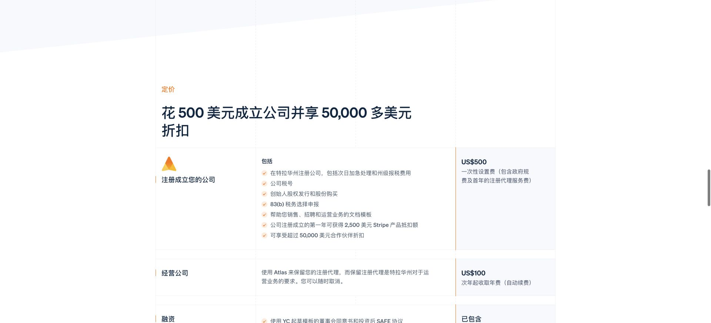
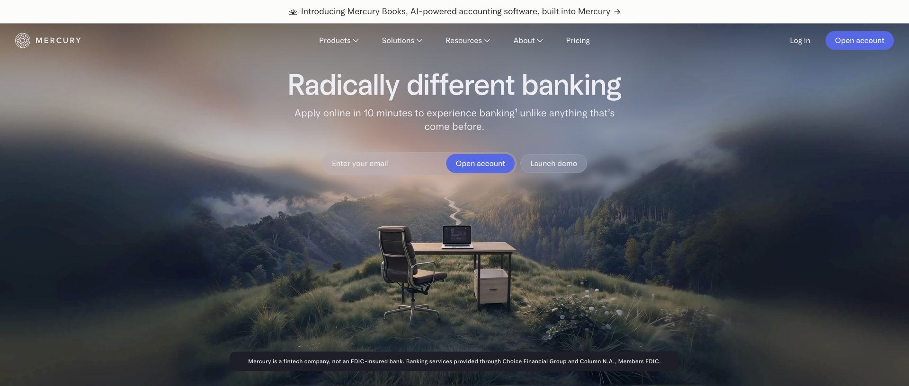
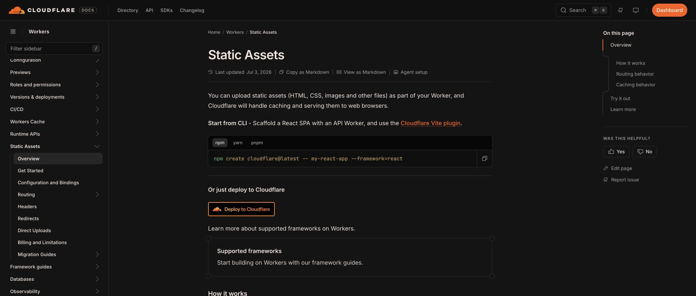
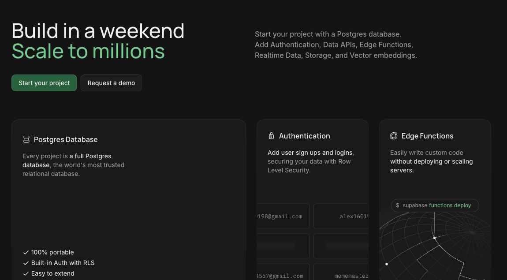
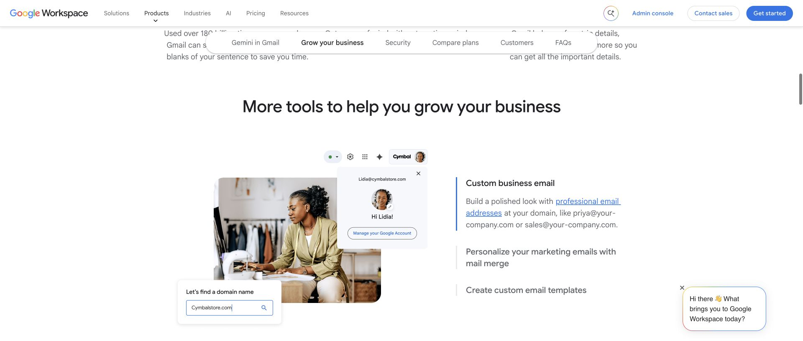
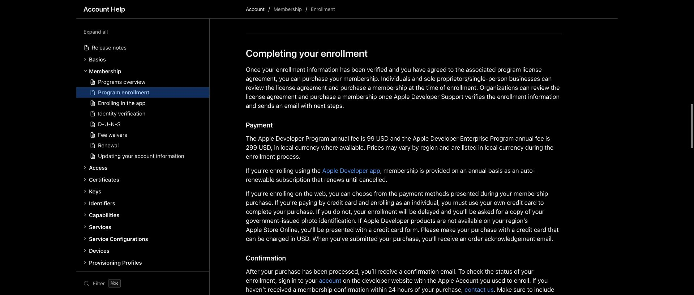
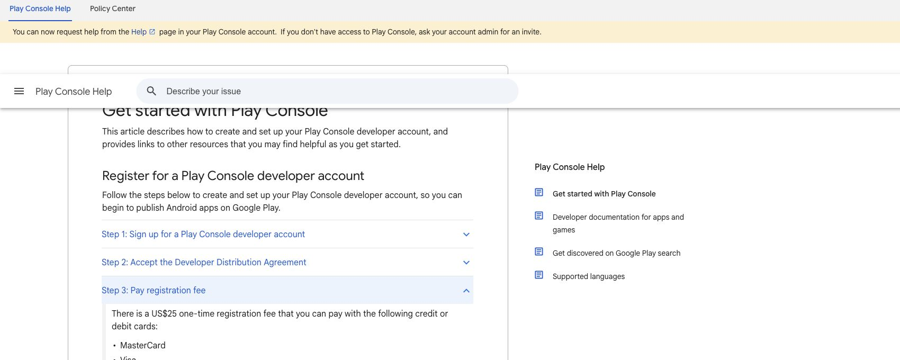

如果从零再做一个面向海外用户的 SaaS，我会先把下面几件事定下来。

这些东西和产品功能关系不大，但迟早要用：客户的钱从哪里收，服务跑在哪里，数据存在哪里，以及别人怎么联系到你。我会尽量选现成的服务，把这部分工作早点做完。

## 公司、银行与收款

如果决定用美国公司来经营，我推荐先看这套组合：**Stripe Atlas 注册公司，Mercury 开企业账户，Stripe 接收客户付款。**

这是一条可选路线。已经有合适的公司主体、银行账户和收款渠道，就没必要为了做 SaaS 再注册一家美国公司。

[Stripe Atlas](https://stripe.com/atlas) 可以协助在特拉华州注册公司、申请公司税号 EIN。它把申请资料和文件处理放进了一个流程，适合先拿来了解注册需要准备什么，具体可以看[官方申请说明](https://docs.stripe.com/atlas/signup)。

目前 Atlas 的一次性费用是 **500 美元**，包含州注册费用和首年的注册代理服务。第二年起，继续使用它的注册代理服务是 **100 美元一年**。500 美元不包含公司以后所有的维护、报税等费用，这笔预算要分开看。

*Stripe Atlas 官方定价页，截图于 2026-10-09。*

企业账户我推荐看 [Mercury](https://mercury.com/)。它提供企业账户和资金管理服务，银行服务由合作银行提供。公司日常的收支有一个独立账户，后面处理起来会清楚一些。

Atlas 和 Mercury 之间也有一个方便的衔接。[Atlas Perks 的官方说明](https://support.stripe.com/questions/sharing-your-company-information-with-atlas-partners?locale=en-GB)列出了 Mercury 的快捷入驻入口，可以在你选择授权后共享部分公司资料，少填一些重复信息。不过，银行开户和 Stripe Payments 启用都还要经过各自审核，注册了公司不等于两个账户一定能开通。

*Mercury 官方公开页面，截图于 2026-10-09。*

网页收款我会优先接 Stripe。第一版可以先用 [Stripe Checkout](https://docs.stripe.com/payments/checkout) 的现成结账页面，它支持一次性付款和订阅。先把下单、付款、开通服务这条流程接好，自定义支付页面可以往后放。

## 域名与部署

域名我推荐在 [Cloudflare Registrar](https://developers.cloudflare.com/registrar/) 买，DNS 和后续部署也方便放在一起管理。

如果技术栈合适，前端和后端接口都可以考虑 Cloudflare。它现在[建议新项目优先使用 Workers](https://developers.cloudflare.com/pages/)，[Workers 也能托管 HTML、CSS、图片等静态文件](https://developers.cloudflare.com/workers/static-assets/)，所以前端不需要再单独找一个平台。

不过，选之前要确认框架和依赖能不能在 Workers 的运行时里工作。一个原本在普通服务器上运行的后端，不能默认搬过去就能跑。

*Cloudflare Workers 的 Static Assets 文档，截图于 2026-10-09。*

另一条路就是自己租一台云服务器。[AWS](https://aws.amazon.com/)、[Azure](https://azure.microsoft.com/)、[Google Cloud](https://cloud.google.com/) 都可以，选自己熟悉、价格能接受的就行。

**很多低并发、轻计算的 SaaS，初期一台服务器就够了。** 如果主要工作是表单提交、数据库查询、调用外部 API，我会先从单台服务器开始。没有必要在第一版就拆成很多服务，或者把复杂的集群架构搭齐。

如果产品本身要在服务器上做大量视频处理、模型推理，那就另说。服务器能承受多少业务，要看实际计算量，不能只看注册用户数。

## 数据库与文件存储

[Supabase](https://supabase.com/) 把数据库和文件存储放在同一个平台里。对一个刚起步的小项目，这能少掉一些搭建和维护工作。

它的[数据库是完整的 Postgres](https://supabase.com/docs/guides/database/overview)。用户资料、订单、项目记录这些结构化数据可以放进去。以后有复杂查询，也能继续用熟悉的 SQL 处理。

图片、PDF、用户上传的附件，则放到 [Supabase Storage](https://supabase.com/docs/guides/storage)。比如用户上传一张图片，文件放 Storage，数据库里记录文件路径以及它属于哪个用户、哪个项目，职责就很清楚。

*Supabase 官网功能介绍，截图于 2026-10-09。*

我推荐它，主要是因为一个人做产品时，不太想同时维护数据库服务和文件服务。先把这两件事交给现成的平台，自己专心写业务逻辑。它还有其他功能，但不用为了用了 Supabase，就把整套产品都接一遍。

## 企业邮箱

域名买好以后，我会配一个企业联系邮箱，比如 `hello@你的域名` 或 `support@你的域名`，用来接客户咨询、合作邮件，或者和平台沟通。

我推荐 [Google Workspace](https://workspace.google.com/intl/en/products/gmail/)。可以用自己的域名收发邮件，日常使用仍然是 Gmail 那套界面。对已经习惯 Gmail 的人来说，这个选择比较省事。

*Google Workspace 官网的 Custom business email 介绍，图中邮箱和人物为官网演示内容。截图于 2026-10-09。*

刚开始先把实际会查看的邮箱配好就行。尤其是网站上留给客户的地址，要有人看、有人回复。

## App 开发者账号

如果只做 Web SaaS，这一项可以跳过。确定要把原生 App 上架到 App Store 或 Google Play，再准备对应平台的开发者账号。

[Apple Developer Program](https://developer.apple.com/help/account/membership/program-enrollment) 的标准费用是 **99 美元一年**，具体地区可能按当地货币结算。[Google Play 开发者账号](https://support.google.com/googleplay/android-developer/answer/6112435?hl=en)是 **25 美元一次性注册费**。

*Apple 官方注册说明，截图于 2026-10-09。*

*Google Play 官方帮助页，截图于 2026-10-09。*

如果用公司名义申请，提前准备公司资料、D-U-N-S 编码、官网和联系方式。Apple 和 [Google 的组织账号](https://support.google.com/googleplay/android-developer/answer/13628312?hl=en)都有身份核验要求，我会在决定做 App 时就开始看申请条件，别等代码写完了才处理。

还有一个容易混在一起的地方：网页接了 Stripe，不代表 App 里的数字订阅可以直接照搬同一套收款方式，仍要核对 [Apple](https://developer.apple.com/app-store/review/guidelines/#in-app-purchase) 和 [Google Play](https://support.google.com/googleplay/android-developer/answer/9858738?hl=en) 对应用内支付的要求。

如果现在只准备做一个 Web 版本，我会先把前四项选好。部署和数据库能用现成服务就先用，确实需要自己控制运行环境，再租服务器。等产品遇到具体限制，再换其中某一部分，起步时不用把以后可能用到的东西全买齐。
