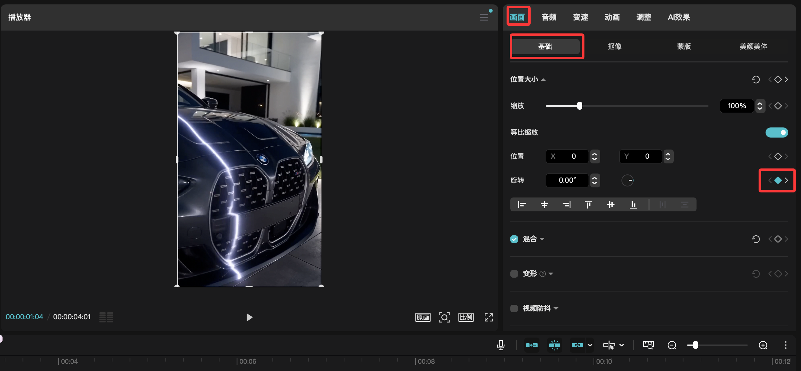

# 剪辑视频学习-DAY1
由于自媒体营销不得不做好短视频剪辑，所以不得不开始研究怎么做好剪辑了。
由于我不是专业靠这个吃饭，所以以目标为导向，只研究我需要学习的剪辑技巧。
今天的两个目标：1.视频旋转 2.多视频同屏

# 视频旋转
这个技巧我认为能增加一些酷炫感，有的时候也适合做音乐卡点。
这里我们使用的是剪映软件。
1. 把手里的视频导入
2. 找到期望开始进行旋转的位置，在右侧的选项卡里找到 画面-基础-旋转，旋转里有一个小棱形，这个叫关键帧，点击它
3. 找到期望完成旋转的位置，依旧是上面的步骤，在添加关键帧后调整旋转角度

# 多视频同屏
这个技巧我认为能增加同一段视频的信息密度，因此也作为第一批学习的目标。
1. 把多个视频放在多个不同的轨道
2. 点击需要缩放的视频，手动缩小视频
3. 调整视频位置

ok，这就是今天学习的记录，明天继续